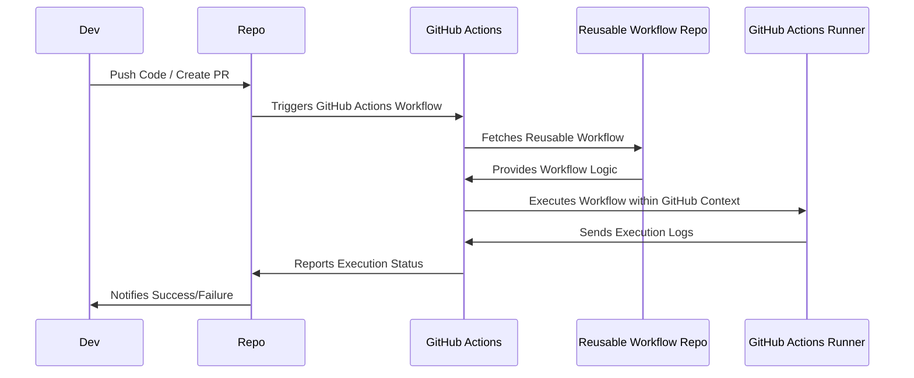

# Kurocado Studio DevOps

Centralizing GitHub Actions workflows in a single repository allows multiple repositories to consume
shared workflows, ensuring uniformity, reducing duplication, and improving scalability.

### Project Status

[DevOps through GitHub Actions](https://kurocado.youtrack.cloud/articles/PLA-A-2/DevOps) is in the
early stages of development. We're sharing it publicly to gather feedback, collaborate with the
community, and improve it over time.

Feel free to open issues or contribute to discussions — your input is valuable!

## Key GitHub Action Workflows

- [Linting](https://kurocado.youtrack.cloud/articles/PLA-A-5/Lint) pipeline using
  - [See the config](https://kurocado.youtrack.cloud/articles/STY-A-8/Prettier) for
    [Prettier](https://prettier.io)
  - [See the config](https://kurocado.youtrack.cloud/articles/STY-A-10/ESLint) for
    [ESLint](https://eslint.org)
  - [See the config](https://kurocado.youtrack.cloud/articles/STY-A-12/CommitLint) for
    [CommitLint](https://commitlint.js.org)
- [Testing](https://kurocado.youtrack.cloud/articles/PLA-A-6/Test) pipeline using
  [Vitest](https://vitest.dev)
- [Release](https://kurocado.youtrack.cloud/articles/PLA-A-3/Release) pipeline using
  [Semantic Release](https://semantic-release.gitbook.io/semantic-release)

## Workflow Execution Flow Overview

This outlines how workflows get triggered and executed. The key steps:

- A consuming repository pushes code (e.g., push or pull_request event).
- It calls a reusable workflow from the central workflow repository.
- The central workflow executes defined CI/CD steps (build, test, deploy, etc.).
- The result (success/failure) is returned to the consuming repository.



### How to Consume

1. **Create a `.github/workflows` Directory:**

   - Inside your repository, you would call the workflows like this:

   ```yaml
   name: CI/CD Pipeline

   on:
     pull_request:
     push:

   jobs:
     lint:
       name: 'Lint Project'
       uses: kurocado-studio/dev-ops/.github/workflows/lint.yml@main

     test:
       name: 'Test Project'
       needs: lint
       uses: kurocado-studio/dev-ops/.github/workflows/test.yml@main
   ```
