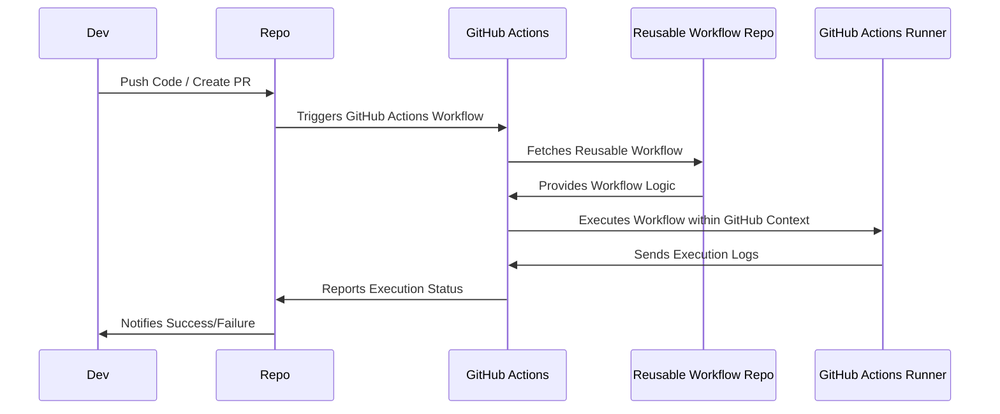

# Overview

|            |                                                                                                                                                                                        |
| ---------- | -------------------------------------------------------------------------------------------------------------------------------------------------------------------------------------- |
| Platform   | <https://kurocado-studio.github.io/platform>                                                                                                                                           |
| Repository | <https://github.com/Kurocado-Studio/dev-ops>                                                                                                                                           |
| Main       |  |

## Workflow Execution Flow Overview

This outlines how workflows get triggered and executed. The key steps:

- A consuming repository pushes code (e.g., push or pull_request event).
- It calls a reusable workflow from the central workflow repository.
- The central workflow executes defined CI/CD steps (build, test, deploy, etc.).
- The result (success/failure) is returned to the consuming repository.

